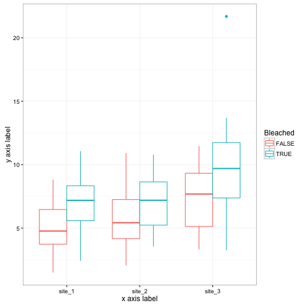

Part_B_time_anomaly
========================================================
author: Etienne Low-Décariedate: 
autosize: true

Housekeeping
===

```r
rm(list=ls())
require(dplyr)
require(ggplot2)
require(reshape)
require(gridExtra)
require(lubridate)
require(tidyr)
require(scales)


theme_set(theme_bw())
```

Function for loading Giovanni time series data
===


```r
load_giovanni_time <- function(path){
  file_data <- read.csv(path, 
                          skip=6,
                          col.names = c("Date",
                                        "Temperature",
                                        "NA",
                                        "Site",
                                        "Bleached"))
  file_data$Date <- parse_date_time(file_data$Date, orders="ymdhms")
  return(file_data)
}
```


Creat a list of timeseries files
===

```r
file.list <- list.files("./Data/timeseries/")
file.list <- as.list(paste0("./Data/timeseries/", file.list))
```

Load all the files
===

```r
all_data <- lapply(X=file.list,
                         FUN=load_giovanni_time)
all_data <- as.data.frame(do.call(rbind, all_data))
```


Inspect the data with a plot
===

```r
p <- qplot(data=all_data,
           x=Date,
           y=Temperature,
           colour=Site,
           linetype=Bleached,
           geom="line")
print(p)
```


#Extract month and year
===

```r
all_data$Year <- year(all_data$Date)
all_data$month <- month(all_data$Date)
```


Sanity check and error removal
===

```r
summary(all_data)
```

```
      Date                      Temperature       NA.         
 Min.   :2002-08-06 12:25:05   Min.   : 3.121   Mode:logical  
 1st Qu.:2006-01-31 10:35:07   1st Qu.: 9.766   NA's:1014     
 Median :2009-07-31 10:40:08   Median :12.649                 
 Mean   :2009-07-31 10:31:27   Mean   :12.410                 
 3rd Qu.:2013-01-31 10:10:09   3rd Qu.:15.274                 
 Max.   :2016-07-31 12:15:10   Max.   :24.205                 
     Site      Bleached            Year          month       
 site_1:338   Mode :logical   Min.   :2002   Min.   : 1.000  
 site_2:338   FALSE:507       1st Qu.:2006   1st Qu.: 4.000  
 site_3:338   TRUE :507       Median :2009   Median : 7.000  
              NA's :0         Mean   :2009   Mean   : 6.509  
                              3rd Qu.:2013   3rd Qu.: 9.000  
                              Max.   :2016   Max.   :12.000  
```


Calculate monthly anomaly
===

```r
monthly_anomaly <- group_by(all_data,
                            month,
                            Site,
                            Bleached) %>%
  mutate(mm_Temperature=mean(Temperature),
         ma_Temperature=Temperature-mean(Temperature))
```

Calcualte yearly anomaly
===

```r
annual_integrated_anomaly <- group_by(monthly_anomaly,
                                      Year,
                                      Site,
                                      Bleached) %>%
  summarise(aia_Temperature=sum(abs(ma_Temperature)))
```

Inspect the data with a plot
===

```r
p <- qplot(data=annual_integrated_anomaly,
           x=Site,
           xlab="x axis label",
           y=aia_Temperature,
           ylab="y axis label",
           colour=Bleached,
           geom="boxplot")
print(p)
```



# Save PDF of plot
===

```r
pdf("./Plots/file.pdf",width=7,height=7)
print(p)
graphics.off()
```

Save file
===

```r
#for plotting or analysis in other software
write.csv(annual_integrated_anomaly,
     file="./Output/annual_integrated_anomaly.csv")
```

Next steps
===
Plotting and statistical analysis to determine if bleaching years are different from years in which no bleaching is reported and if site where bleaching is reported are different from sites were bleaching is not reported
